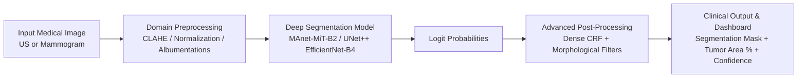

# 🎗️ Breast Oncology Surveillance System (BOSS)

[](https://pytorch.org/)
[](https://streamlit.io/)
[](https://github.com/qubvel/segmentation_models.pytorch)
[](https://opensource.org/licenses/MIT)

An end-to-end Deep Learning diagnostic-assistance platform for **multi-modality breast lesion segmentation** across **Ultrasound (US)** and **Digital Mammography (MG)**. BOSS provides accurate boundary delineation, tumor burden estimation, and real-time interactive visualization to assist radiologists and oncology specialists in clinical decision workflows.

---

## 📌 Key Highlights

- **Multi-Modality Segmentation**: Tailored neural pipelines optimized for both **Ultrasound** speckle/acoustic patterns and **Digital Mammography** tissue densities.
- **State-of-the-Art Architectures**:
  - **Ultrasound (US)**: `MAnet` (Multi-scale Attention Net) with **MiT-B2 (SegFormer Vision Transformer)** encoder.
  - **Mammography (MG)**: `UnetPlusPlus (U-Net++)` with **EfficientNet-B4** backbone pretrained on ImageNet.
- **Oncology-Targeted Loss Formulation**:
  - **Asymmetric Tversky Loss ($\alpha=0.7, \beta=0.3$)**: Heavier penalization for False Negatives (FN) to ensure critical occult lesions are not missed.
  - **Combined BCE + Dice Loss**: Compensates for extreme class imbalance between tiny lesion masks and large background parenchyma.
- **Advanced Clinical Post-Processing**:
  - **Dense CRF (Conditional Random Fields)**: Refines mask contours to snap strictly to structural image gradients.
  - **Morphological Filtering & Size Thresholding**: Eliminates spurious noise and smooths lesion topology.
- **Interactive Radiologist Dashboard**: Full-featured **Streamlit** interface with real-time threshold tuning, overlay transparency controls, lesion coverage area metric ($cm^2$ / pixel %), and one-click JSON/PNG reporting.
- **CLI & Integration-Ready**: Includes a standalone CLI inference pipeline (`cli_inference.py`) for headless deployment and hospital PACS/EMR integration.

---

## 🛠️ Architecture & Pipeline Overview



### Modality Specifications

| Modality | Default Backbone | Architecture | Key Preprocessing | Loss Function |
| :--- | :--- | :--- | :--- | :--- |
| **Ultrasound (US)** | `mit_b2` (Transformer) | `MAnet` | Resizing, Albumentations spatial augs | Tversky ($\alpha=0.7, \beta=0.3$) + Weighted BCE |
| **Mammography (MG)**| `efficientnet-b4` | `UnetPlusPlus` | CLAHE, Percentile Normalization (1%-99%) | Dice Loss + BCE |

---

## 📂 Project Structure

```text
Breast-Oncology-Surveillance-System/
├── models/                     # Saved model checkpoints (.pth)
│   ├── us_model.pth            # Ultrasound segmentation weights
│   └── mg_model.pth            # Mammography segmentation weights
├── src/
│   ├── app.py                  # Streamlit Radiologist Web Dashboard
│   ├── cli_inference.py        # Headless CLI Inference & JSON output
│   ├── dataset_us.py           # Ultrasound dataset loader & augmentations
│   ├── dataset_mg.py           # Mammography dataset loader & CLAHE pipeline
│   ├── train_us.py             # Ultrasound training pipeline (PyTorch)
│   └── train_mg.py             # Mammography training pipeline (PyTorch)
├── requirements.txt            # Python dependencies
└── README.md                   # Project documentation
```

---

## 🚀 Quick Start

### 1. Clone & Setup Environment

```bash
git clone https://github.com/bousliminadhem/Breast-Oncology-Surveillance-System.git
cd Breast-Oncology-Surveillance-System

# Create virtual environment
python -m venv .venv
source .venv/bin/activate  # On Windows: .venv\Scripts\activate

# Install dependencies
pip install -r requirements.txt
```

### 2. Launch the Streamlit Dashboard

```bash
streamlit run src/app.py
```
Open your browser at `http://localhost:8501`.

### 3. Run Headless CLI Inference

For automated processing or external backend integration:
```bash
python src/cli_inference.py <path_to_image> <us|mg>
```

**Sample Output (JSON):**
```json
{
  "maskBase64": "iVBORw0KGgoAAAANSUhEUg...",
  "tumorArea": 4.12,
  "diagnosis": "Malignant",
  "confidence": "91.8%"
}
```

---

## 📊 Evaluation & Clinical Metrics

The models are validated using standard medical segmentation metrics:
- **Dice Similarity Coefficient (DSC / F1-Score)**: Measures volumetric overlap with ground-truth lesion contours.
- **Intersection over Union (IoU / Jaccard Index)**: Quantifies spatial intersection over total area.
- **False Negative Rate (FNR)**: Closely monitored and minimized to prevent missed lesions.

---

## 🔬 Technologies Used

- **Deep Learning**: PyTorch, Torchvision, Segmentation Models PyTorch (`smp`), Albumentations
- **Computer Vision & Post-Processing**: OpenCV, PyDenseCRF, Scikit-Image, NumPy
- **Application & Visualization**: Streamlit, Matplotlib, PIL
- **Acceleration**: Mixed Precision (`torch.amp`), CUDA / CuDNN

---

## 👨‍💻 Author

**Adhem Bouslimi**  
- GitHub: [@bousliminadhem](https://github.com/bousliminadhem)

---

## 📜 License
This project is open source and available under the [MIT License](LICENSE).
